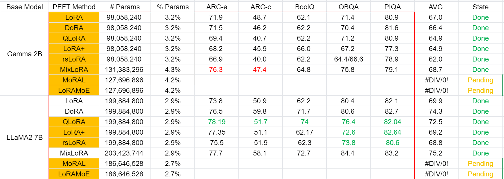

# Awesome-LLM-LoRA

## Table Content
- [TableContent](README.md#table-content)
- [Experiments](README.md#experiments)
- [Timeline of LoRA](README.md#timeline-of-lora)
- [Overview of the LoRA Family](README.md#overview-of-the-lora-family)
- [Paper List](README.md#paper-list)
    - [LoRA Related](README.md#lora-related)
    - [MoE LoRA](README.md#moe-lora)
- [Acknowledge](README.md#acknowledge)
- [Update Log](README.md#update-log)
- [reference](README.md#reference)

## Experiments
We explored the fine-tuning effects of various versions of LoRA and MoE LoRA on different models across various datasets. We endeavored to ensure that different variants of LoRA had similar numbers of parameters when fine-tuning the same model for ease of comparison. \
For details of the experimental process, please click <u>[here](./experiment/README.md)</u>

Here are the results of our experiments:

## Timeline of LoRA

## Overview of the LoRA Family
|LoRA           |     Character                 |  |    |
|---------------|-------------------------------|--|----|
|LoRA+          |效率提升：LoRA+ 是一种有效的低秩调整方法，通过设置不同的学习率来调整 LoRA 适配器矩阵 A 和 B，从而提高特征学习的效率。LoRA+ 在大型模型的微调中表现出比 LoRA 更优异的性能（1% - 2% 改进）和微调速度（最多可达约 2倍速度提升），并且在计算成本上与 LoRA 相当。	|学习率设置：LoRA+ 的关键创新在于为 LoRA 适配器矩阵 A 和 B 设置不同的学习率，通过选择一个合适的固定比率，纠正了 LoRA 存在的子优性。在 LoRA+ 中，将适配器矩阵 A 和 B 的学习率设置为不同的值，以提高特征学习的效率。	|实验验证：通过广泛的实验研究，LoRA+ 在性能和微调速度方面均有显著改进，同时保持与 LoRA 相当的计算成本。LoRA+ 的改进使得在大型模型的微调中能够更高效地进行特征学习，提高了模型的性能和微调速度。
|PeriodicLoRA   |参数高效：PeriodicLoRA (PLoRA) 是一种参数高效的微调方法，通过积累低秩更新矩阵多次来实现更高的更新秩，从而提高学习能力，同时不增加内存使用量。|周期性卸载策略：PLoRA采用基于动量的卸载策略，周期性地将LoRA权重训练的结果卸载到骨干参数中，然后重新初始化LoRA状态，包括权重、优化器状态和学习率调度器状态	|多阶段训练：PLoRA具有多个训练阶段，在每个阶段结束时，将LoRA权重卸载到骨干参数，重新初始化LoRA状态。通过这种方式，PLoRA能够突破低秩更新矩阵的限制，接近完全微调的效果
|VeRA           |Vector-based Random Matrix Adaptation (VeRA): 本文提出的方法名为 Vector-based Random Matrix Adaptation (VeRA)，它通过使用一对共享的低秩矩阵并学习小的缩放向量，显著减少了可训练参数的数量，同时保持了与 LoRA 相同的性能水平。VeRA 在 GLUE 和 E2E 基准测试、图像分类任务以及应用于 7B 和 13B 语言模型的指令微调中展示了其有效性。	|低存储挑战：本文指出，传统的 Low-rank adapation (LoRA) 方法在将大型语言模型微调时仍面临着存储挑战，特别是在扩展到更大模型或部署大量用户或任务适应模型时。VeRA 方法通过使用共享的低秩矩阵和学习小的缩放向量，显著减少了可训练参数的数量，从而解决了存储挑战。	|无额外推理时间成本：VeRA 方法是一种新颖的微调方法，没有额外的推理时间成本。与 LoRA 方法相比，VeRA 进一步减少了可训练参数的数量，同时产生了可比较的结果。该方法在自然语言理解（GLUE）和自然语言生成（E2E）基准测试上与 LoRA 和其他参数高效的适应方法进行比较，并在指令遵循和图像分类任务上与 LoRA 进行比较。
|LoRA-FA        |LoRA-FA：LoRA-FA 是一种内存高效的微调方法，旨在减少激活内存的使用，而不降低性能或增加昂贵的重计算。LoRA-FA选择在每个 LoRA 层中冻结 A 的投影向下权重，并更新 B 的投影向上权重。这确保了在 LLM 微调期间，模型权重的变化保持在低秩空间，同时消除了存储完整秩的输入激活的要求。LoRA-FA在多个模型类型（RoBERTa、T5、LLaMA）和模型规模上进行了广泛的实验。|实验结果表明，与完全参数微调和 LoRA 相比，LoRA-FA在不同任务中始终能够实现接近的微调准确性，并且可以将整体内存成本降低高达 1.4 倍。	内存高效：LoRA-FA 方法致力于解决微调大型语言模型时的内存挑战，通过冻结 A 的投影向下权重和更新 B 的投影向上权重，有效减少激活内存的使用，同时保持良好的微调性能。LoRA-FA 的设计旨在确保模型权重的变化在低秩空间中进行，从而降低内存消耗，使得在微调过程中更加高效。	|性能保持：LoRA-FA 方法的关键特性之一是能够在保持性能的同时降低内存成本。通过冻结和更新特定的投影权重，LoRA-FA 确保了模型在微调过程中的稳定性和准确性，同时减少了对昂贵激活内存的需求。该方法在实验中展现出与完全参数微调和 LoRA 相媲美的微调准确性，同时显著降低了内存成本。
|LoRA-drop      |LoRA-drop：LoRA-drop 是一种有效的 LoRA 参数修剪方法，通过分析 LoRA 输出来评估参数的重要性。LoRA-drop 通过分析 LoRA 输出来评估参数的重要性，保留对重要层的 LoRA，而其他层的 LoRA 共享相同的参数。该方法在自然语言理解（NLU）和自然语言生成（NLG）任务中进行了大量实验，证明了其有效性。|	参数效率：LoRA-drop 旨在进一步提高 LoRA 的参数效率，通过评估 LoRA 参数的重要性，并根据 LoRA 输出进行修剪。LoRA-drop 的设计考虑了参数与数据相关的 LoRA 输出对冻结模型的直接影响，从而实现了对参数的有效修剪，提高了参数的利用效率。	|实验验证：LoRA-drop 方法通过在多个 NLU 和 NLG 任务上进行广泛实验，展示了其与原始 LoRA 方法相当的结果，同时只使用 LoRA 参数的 50%。分析实验进一步证明了 LoRA-drop 的有效性。
|AdaLoRA        |AdaLoRA：AdaLoRA 是一种自适应参数分配的方法，用于参数高效的微调。AdaLoRA 根据权重矩阵的重要性评分自适应地分配参数预算。该方法通过奇异值分解形式参数化增量更新，有效地修剪不重要更新的奇异值，从而降低其参数预算，同时避免了繁重的精确奇异值分解计算。AdaLoRA 在自然语言处理、问答和自然语言生成等多个领域进行了广泛实验，验证了其有效性。	|参数效率：AdaLoRA 旨在提高参数效率，通过自适应地分配参数预算，实现了对权重矩阵的重要性评分。该方法能够有效地修剪不重要的更新，从而降低其参数预算，同时提高微调性能。AdaLoRA 的设计考虑了权重参数的重要性，以实现更有效的参数分配。	|实验验证：AdaLoRA 方法通过在自然语言处理、问答和自然语言生成等多个领域的广泛实验中进行验证。实验结果表明，AdaLoRA 在低预算设置下显著优于基线方法，取得了显著的改进。AdaLoRA 在多个任务和预训练模型上都展现出了优异的性能。
|DoRA           |Weight-Decomposed Low-Rank Adaptation (DoRA)：DoRA 是一种权重分解的低秩适应方法，通过将预训练权重分解为大小和方向两个组件进行微调。DoRA 使用 LoRA 进行方向性更新，以有效减少可训练参数的数量，同时增强 LoRA 的学习能力和训练稳定性。该方法在各种下游任务上（如常识推理、视觉指令微调、图像/视频文本理解）表现出优越性能。	|增强学习能力：DoRA 旨在提高 LoRA 的学习能力，通过权重分解分析探索全参数微调（FT）和 LoRA 之间的内在差异。DoRA 通过将权重分解为大小和方向两个组件，并对两者进行微调，从而实现了对 LoRA 的增强学习能力，同时避免了额外的推理开销。	|训练稳定性：DoRA 方法通过权重分解和方向性更新，提高了 LoRA 的训练稳定性，同时避免了在全参数微调中出现的昂贵的训练成本。该方法在实验中表现出与 LoRA 和全参数微调的显著差异，展示了其在参数高效微调中的有效性。
|Delta-LoRA     |Delta-LoRA：Delta-LoRA 是一种新颖的参数高效微调方法，用于微调大型语言模型（LLMs）。与 LoRA 和其他低秩适应方法（如 AdaLoRA）不同，Delta-LoRA 不仅更新低秩矩阵 A 和 B，还通过利用两个低秩矩阵的乘积的增量更新（A(t+1)B(t+1) − A(t)B(t)）将学习传播到预训练权重 W。这种策略有效地解决了低秩矩阵的增量更新对于学习适用于下游任务的表示能力不足的局限性。此外，由于更新 W 不需要计算 W 的梯度并存储它们的动量，Delta-LoRA 与 LoRA 共享可比较的内存需求和计算成本。广泛的实验表明，Delta-LoRA 显著优于现有的低秩适应方法。	|增强学习能力：Delta-LoRA 旨在通过权重分解和增量更新来增强 LoRA 的学习能力。该方法通过将预训练权重分解为大小和方向两个组件，并对两者进行微调，从而实现了对 LoRA 的增强学习能力。Delta-LoRA 在各种下游任务（如常识推理、视觉指令微调、图像/视频文本理解）中表现出优越性能。	|内存和计算效率：Delta-LoRA 通过有效地更新预训练权重 W，避免了计算 W 的梯度和存储它们的动量，从而保持了与 LoRA 相当的内存需求和计算成本。该方法在提高学习能力的同时，保持了内存和计算效率，为微调大型语言模型提供了一种高效的方法。

## Paper List
### LoRA Related
- LORA
- LoRA+：[2402.12354.pdf](https://arxiv.org/pdf/2402.12354.pdf)
- PLoRA：[2402.16141.pdf](https://arxiv.org/pdf/2402.16141.pdf)
- VeRA：[2310.11454.pdf](https://arxiv.org/pdf/2310.11454.pdf)
- LoRA-FA：[2308.03303.pdf](https://arxiv.org/pdf/2308.03303.pdf)
- LoRA-drop：[2402.07721.pdf](https://arxiv.org/pdf/2402.07721.pdf)
- AdaLoRA：[2303.10512.pdf](https://arxiv.org/pdf/2303.10512.pdf)
- DoRA DoRA: [Weight-Decomposed Low-Rank Adaptation](https://arxiv.org/pdf/2402.09353.pdf)
- Delta-LoRA： [2309.02411.pdf](https://arxiv.org/pdf/2309.02411.pdf)

### MoE LoRA
- MoE-LoRA: [2402.12851.pdf](https://arxiv.org/pdf/2402.12851.pdf)  --  [repo]()
- PESC: [2401.02731.pdf](https://arxiv.org/pdf/2401.02731.pdf) --  [repo](https://github.com/wuhy68/Parameter-Efficient-MoE)
- [Higher Layers Need More LoRA Experts ](https://arxiv.org/pdf/2402.08562.pdf)  --  [repo](https://github.com/GCYZSL/MoLA)
- LoRA-MOE (fudan): [96f0cfd7-79c7-4110-88e5-4ea80a7fbc8d.pdf (baai.ac.cn)](https://simg.baai.ac.cn/paperfile/96f0cfd7-79c7-4110-88e5-4ea80a7fbc8d.pdf)  --  [repo](https://github.com/Ablustrund/LoRAMoE)
- MoE-LoRA (javis): [2310.18339.pdf ](https://arxiv.org/pdf/2310.18339.pdf)  --  [repo](https://github.com/liuqidong07/MOELoRA-peft)
- MoA: [2403.03432.pdf ](https://arxiv.org/pdf/2403.03432.pdf)  --  [repo]()
- [MoSA-Mixture-of-Sparse-Adapters-for-Visual-Efficient-Tuning.pdf (researchgate.net)](https://www.researchgate.net/profile/Bocheng_Zou/publication/376312824_MoSA_Mixture_of_Sparse_Adapters_for_Visual_Efficient_Tuning/links/660b760e390c214cfd2fa277/MoSA-Mixture-of-Sparse-Adapters-for-Visual-Efficient-Tuning.pdf) (MLLM) 
- MoRAL: MoE Augmented LoRA for LLMs' Lifelong Learning: [2402.11260 ](https://arxiv.org/abs/2402.11260)  --  [repo]()
- MoCLE (MLLM): [2312.12379.pdf ](https://arxiv.org/pdf/2312.12379.pdf)  --  [repo](https://gyhdog99.github.io/projects/mocle/)
- MoE-LLaVA (MLLM): [2401.15947.pdf](https://arxiv.org/pdf/2401.15947.pdf)  --  [repo](https://github.com/PKU-YuanGroup/MoE-LLaVA)
- MOLE: [pdf (openreview.net)](https://openreview.net/pdf?id=uWvKBCYh4S)  --  [repo]()(VISION)
- MLoRE (vision): [2403.17749.pdf ](https://arxiv.org/pdf/2403.17749.pdf)  --  [repo](https://github.com/YuqiYang213/MLoRE)
- OCTAVIUS (MLLM): [2311.02684.pdf ](https://arxiv.org/pdf/2311.02684.pdf)  --  [repo]()
- MixLoRA (MLLM): [arxiv.org/pdf/2402.15896.pdf](https://arxiv.org/pdf/2402.15896.pdf) --  [repo]()
- Adamix: [2205.12410.pdf ](https://arxiv.org/pdf/2205.12410.pdf)  --  [repo]()
- [Combining Parameter-efficient Modules for Task-level Generalisation](https://aclanthology.org/2023.eacl-main.49.pdf)  --  [repo]()
- SIRA: [2311.09179.pdf ](https://arxiv.org/pdf/2311.09179.pdf)  --  [repo]()
- LLaVA-MoLE: [2401.16160.pdf](https://arxiv.org/pdf/2401.16160.pdf)  --  [repo]()

## Acknowledge

## Update Log
| Version                  | Time       | Update Content                                               |
| ------------------------ | ---------- | ------------------------------------------------------------ |
| V1                       | 2024/4/20 | The initial version.                                         |

## reference
